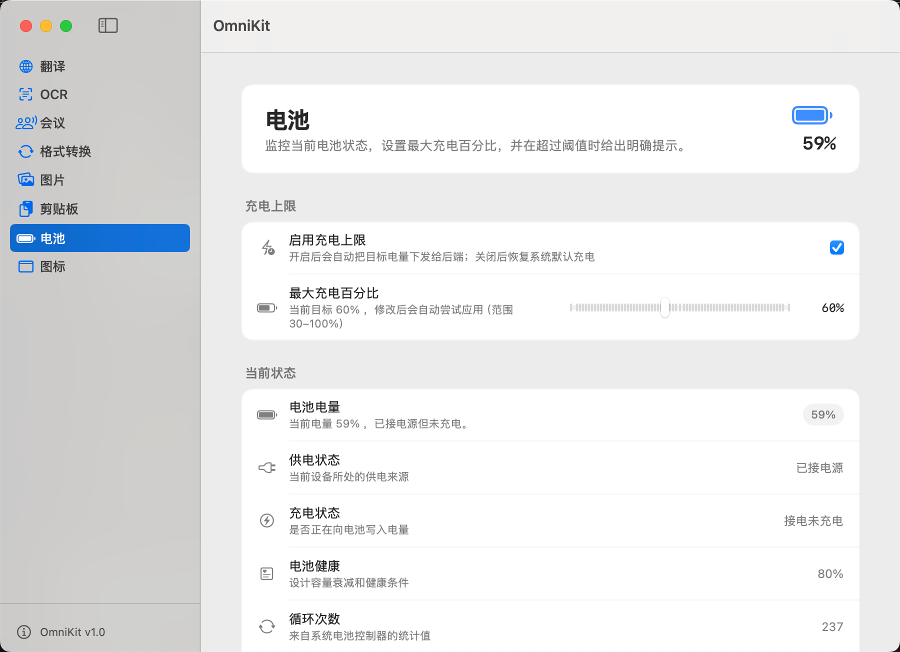

# OmniKit

[中文](#中文) | [English](#english)

---

## 中文

macOS 菜单栏效率工具箱，把翻译、OCR、会议转写、格式工具、图片处理、剪贴板历史、电池与第三方菜单栏图标整理等常用能力集中在一个应用里。

### 功能

- **翻译**：接入阿里云机器翻译，支持输入翻译与划词翻译，带系统级浮窗入口。
- **OCR**：截图后结合 Apple Vision 识别文字，结果可写入剪贴板。
- **会议**：录音、实时转写、记录管理与回放，便于整理语音内容。
- **格式工具**：JSON 提取与格式化、UUID / 身份证号生成、文本加解密等快捷弹窗。
- **图片**：压缩、格式转换、翻转等轻量处理。
- **剪贴板**：记录文本、代码、图片与文件复制历史，支持搜索、筛选、固定与快速回贴。
- **电池**：状态、健康、循环次数展示；充电上限与相关检测（视硬件与系统而定）。
- **图标**（隐藏 / 整理菜单栏）：管理第三方 App 的菜单栏状态栏图标。可启用「折叠收纳区」（类似 Hidden Bar，用折叠按钮与分隔线把已收纳图标收到一侧；多数运行时图标需先按住 ⌘ 拖到分隔线左侧以纳入收纳组）。少数 App 若向系统写入了可持久化的显示/隐藏开关，也可在 OmniKit 里直接切换。系统控制项请在「系统设置 › 控制中心」中调整。

### 使用说明

**环境要求**

- macOS 15.7 或更高版本  
- Xcode 16 或更高版本（自行从源码构建时）

**安装与运行**

1. 克隆仓库后进入项目目录。  
2. 用 Xcode 打开 `OmniKit.xcodeproj`，选择 `OmniKit` Scheme 并运行。

**权限与配置**

首次使用按模块需要授予系统权限：

- **麦克风**：会议录音  
- **语音识别**：会议转写  
- **屏幕录制 / 截图相关**：OCR 截图识别  
- **辅助功能**：部分全局快捷键与自动回贴  

启用**翻译**时，在应用设置中填写阿里云机器翻译的 `AccessKey ID` 与 `AccessKey Secret`。

**日常用法**

- **主窗口**：侧边栏选择模块，统一管理各功能配置与快捷键。  
- **本应用的菜单栏图标**：点击可快速打开翻译、OCR、格式工具、图片、剪贴板、会议等，无需先切到主窗口。  
- **「图标」模块**：专门用来收纳或隐藏*其他 App* 留在菜单栏里的图标，与上一项不是同一回事。  
- 各模块的快捷键可在对应设置页中自定义。

**开源许可**：本项目采用 [MIT License](LICENSE)。

---

## English

A macOS menu bar productivity app that bundles translation, OCR, meeting transcription, format utilities, image tools, clipboard history, battery info, and third-party menu bar icon management in one place.

### Features

- **Translation**: Alibaba Cloud Machine Translation, input and selection-based translation with floating panels.
- **OCR**: Screenshot plus Apple Vision; copy recognized text to the clipboard.
- **Meeting**: Recording, live transcription, record management, and playback.
- **Format tools**: JSON extract/format, UUID / ID generation, text encrypt/decrypt, and similar quick panels.
- **Image**: Compression, format conversion, flip, and other lightweight edits.
- **Clipboard**: History for text, code, images, and files—search, filter, pin, and paste back quickly.
- **Battery**: Status, health, cycle count; charge limit and related checks (hardware and OS dependent).
- **Icons (hide / organize the menu bar)**: Manage other apps’ status bar items. Enable a foldable stash zone (Hidden Bar–style, chevron + separator; for most runtime items, hold ⌘ once to drag them left of the separator to join the stash). A few apps expose a persistent hide/show switch—OmniKit can toggle those when available. For system items, use **System Settings › Control Center**.

### Usage

**Requirements**

- macOS 15.7 or later  
- Xcode 16 or later (when building from source)

**Build and run**

1. Clone the repository and open the project folder.  
2. Open `OmniKit.xcodeproj` in Xcode, select the `OmniKit` scheme, and run.

**Permissions and configuration**

Grant macOS permissions as needed:

- **Microphone**: meeting recording  
- **Speech recognition**: transcription  
- **Screen recording / capture**: OCR  
- **Accessibility**: some global shortcuts and auto-paste  

For **translation**, set Alibaba Cloud Machine Translation `AccessKey ID` and `AccessKey Secret` in app settings.

**Day-to-day**

- **Main window**: pick a module in the sidebar to configure features and shortcuts.  
- **OmniKit’s own menu bar item**: quick access to translation, OCR, format tools, image tools, clipboard, meetings, etc., without bringing the main window to the front.  
- **The “Icons” module**: for folding/hiding *other apps’* menu bar icons—separate from the item above.  
- Customize shortcuts per module in its settings page.

**License**: this project is under the [MIT License](LICENSE).
